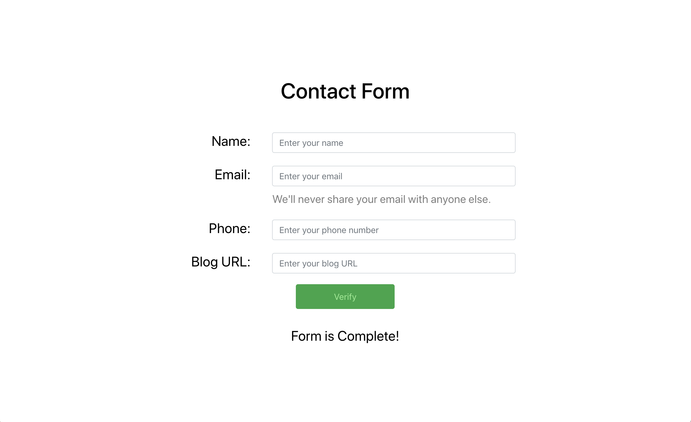
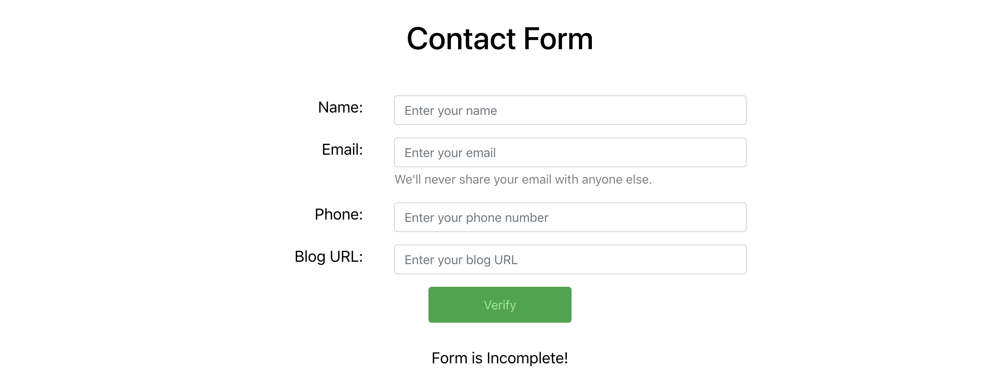
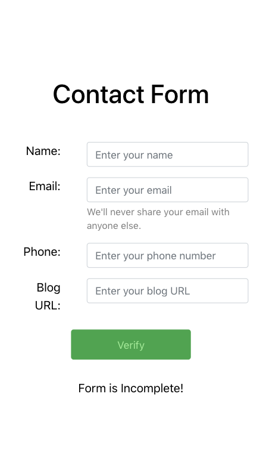

# mini-front-end-coding-challenge
---

The goal of this mini project is to build a small form with some validation. 

### Constraints
* It's important to have a clear way to setup and run your code, for ex.:
    `make setup`
    `make run`
    `yarn start`
Let us know the start command.

* The project should run on Mac OS or Linux.
* **The challenge should be completed within a week. If you need more time, please ask for it.**

### What will be evaluated?

* Completion of requirements.
* Code organization.
* Code quality.
* Setup and run.
* Tests.

### Description
This project consists of building a form to validate contact information.

The form contains four fields:
* Name: A string that consists of between 3 and 30 (inclusive) upper and lower case English alphabetic letters only.
* E-mail: A standard email address. For example, user@domain.extension is valid but user@domain is not.
* Phone: A 10-digit number that does not begin with 0 or 1.
* Blog URL: A standard URL that covers cases such as http://domain.extension, http://www.domain.extension, www.domain.extension, and domain.extension.
* The entire form should get validated on button click based on the criterions mentioned above and display a message accordingly.
If all input fields contain valid values, the message Form is Complete! should be displayed.
If one or more fields contains an invalid value, the message Form is Incomplete! should be displayed.

### Frontend
You should create the frontend using JavaScript.

Feel free to use your most familiar framework or pure JavaScript. React will be a bonus.

We will be evaluating the HTML and CSS as well, so take special care with it. Flexbox will be a bonus.

Below you can see a suggestion for the frontend. You don't need to implement as suggested but as similar as possible.

### Important Notes
* **The bonuses mentioned above represent our current stack. Do not feel pressured to use it. It is more important to do a good code challenge than trying to use something different from what you know well.**
* You can use any open source tools to develop this project, but please, document why.
* You can use a harness like [create-react-app](http://github.com/facebook/create-react-app) to start an app and [react-scripts](http://www.npmjs.com/package/react-scripts) to automate serving and testing of the application.
* If you have any questions, please ask.
* If you had an idea for future implementations or something that you would like to do but didn't have time, please share.
